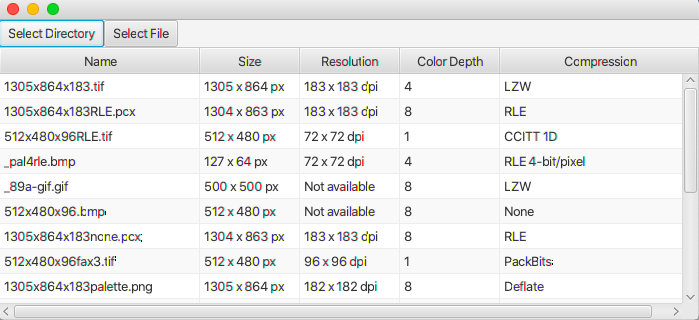

# Image Info app

This is an app that shows the following informations about image files:
- name
- size (in pixels)
- resolution (vertical and horizontal, in dpi)
- color depth (in bits per pixel)
- compression

Please note that not all of this information might be available. For example, some file formats (such as GIF) do not specify resolution. Other formats allow some of the fields to be empty. __Also, apparently some of the testing files' names and their contents are not the same.__ (For example, ```1305х864х183RLE.bmp``` contains uncompressed data.

For extracting this information from the file I've used [metadata-extractor](https://github.com/drewnoakes/metadata-extractor).


## Usage


Pick a directory or a file using one of the buttons above. The list of image files with their selected attibutes will appear.

## Structure
- [ui](src/main/java/com/emelianova/ui) is a JavaFX class that handles user interface
- [imageinfo](src/main/java/com/emelianova/ui) is a simple class that extracts attibutes from image files
